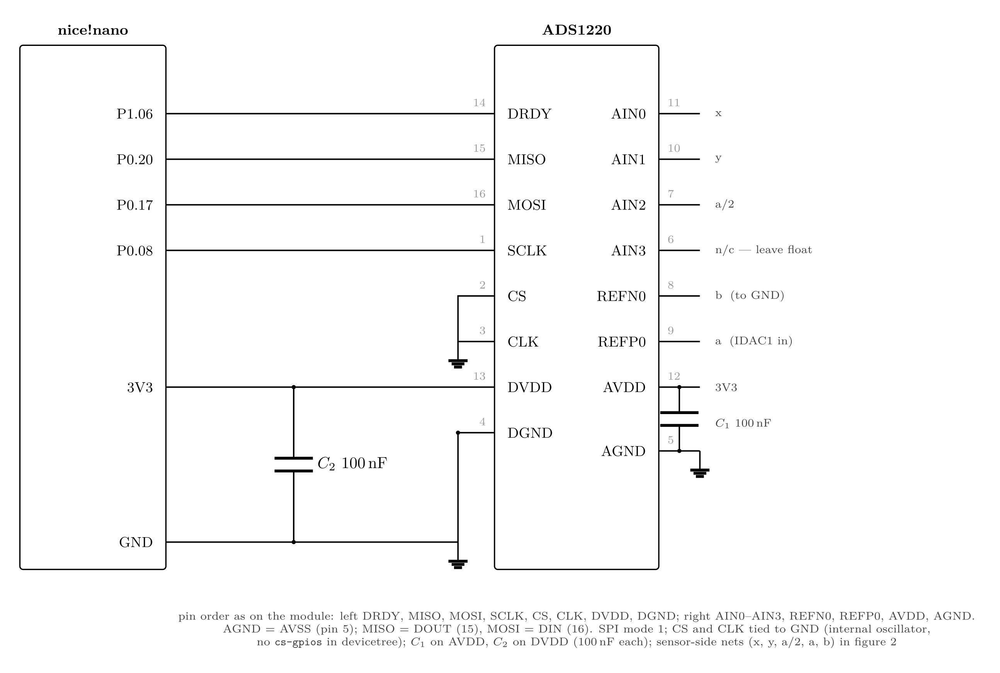
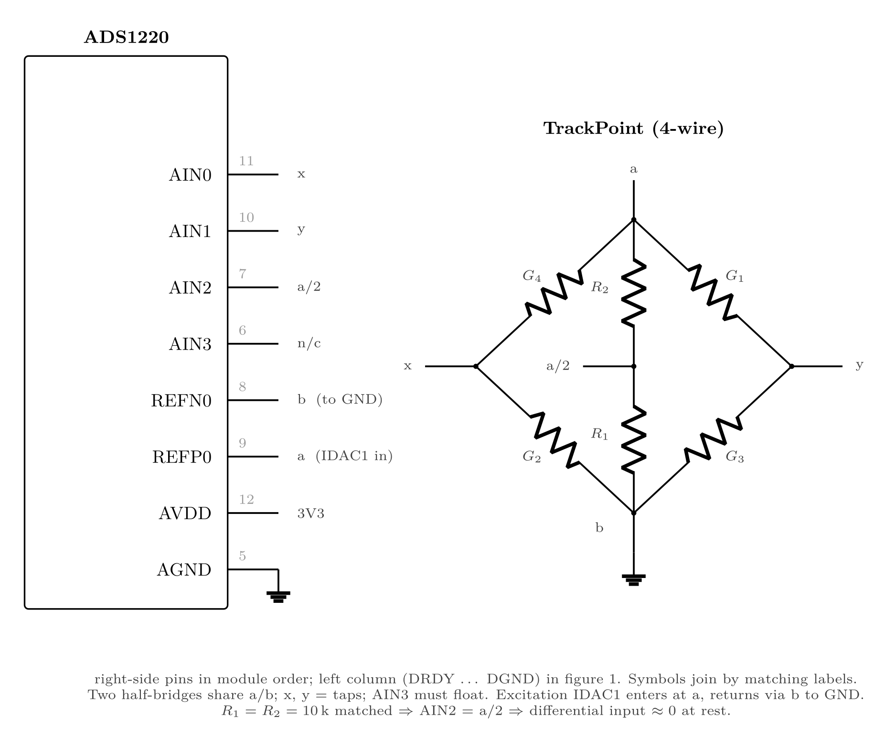

# AGENTS.md

## What this repo is
TrackPoint 4-wire strain gauge -> ADS1220 (SPI) -> nice!nano (ZMK).
`README.md` is the design of record; `layout/board.md` is the perfboard layout.
`ads1220-tpoint/` is the circuit diagram (source `.tex`; exports `.pdf`/`.svg`/`.png`):
page 1 = pinout + digital + power, page 2 = analog front-end.
Changes are gated through numbered Experiments.




## Reference projects
Two external projects are cloned locally (shallow, untracked) under `refs/` for
offline reading; `refs/README.md` holds the URLs, commit SHAs and licenses.
(Added at the user's request — a deliberate exception to "no change without an
experiment".)

### `Magid-William/Articles` → `TrackPoint/README.md`
The only public guide that takes the TrackPoint → ZMK analog route.
1. **The 24-bit-ADC approach is unshipped upstream.** §5.3 is "coming soon" — no
   wiring or firmware — and names `badjeff/ads1220-zephyr-module` as its planned
   driver. There is no analog reference build to copy; this repo is ahead of it.
2. **The drift is the reason to go analog.** The random cursor drift is shared by
   both shipping digital approaches (PS/2 software-only and the AVR co-processor),
   i.e. it lives in the PS/2 decode path. The co-processor costs ~3× software-only
   (3–4 %/day vs 1 %/day on 1050 mAh).
3. **Bench facts.** The USB controller is a separate PCB de-soldered from the
   sensor (delicate); GPIO-PS/2 decode is fragile (one late CLK edge → bogus
   full-scale delta); UART backends at 9600/14400/19200 all failed on this module.

### `badjeff/ads1220-zephyr-module`
The driver module this build depends on (Apache-2.0).
1. **Three drivers, not one.** `ti,ads1220` ADC; `ti,ads1220-gpio` (runtime IDAC
   switch + suspend/resume); `analog-axis-hires` (Zephyr `analog-axis` widened to
   int32 for 24-bit). This design uses all three; the module `select`s
   `ADC_CONFIGURABLE_EXCITATION_CURRENT_SOURCE_PIN` itself, so no extra `.conf`.
2. **Power is pure devicetree.** `poll-period-downshift-ms` + `poll-period-en-gpios`;
   a final period of `0` suspends the sensor but then needs an external
   `ANALOG_AXIS_HIRES_ATTR_RESUME` call — this is why D12 stops at a 1300 ms floor.
3. **CS deviation to validate.** Every module example wires the ADC with
   `cs-gpios = <&gpio0 6 …>`; D6 ties CS to GND and omits `cs-gpios`, a case the
   module does not demonstrate. Tracked in README §8.

## Bench notes
- **COM8 is the likely nice!nano USB serial port** (the default in
  `flash-nicenano.ps1`). COM numbers are assigned per USB port, so confirm before
  use: `Get-PnpDevice -Class Ports -Status OK`. A stale-but-listed COM8 is
  normal — in EXP01 the board enumerated as COM22 while COM8 sat unused.
- ZMK's USB IDs (`VID_1D50&PID_615E`) only say "a ZMK device"; a XIAO running
  ZMK presents identically. The UF2 drive volume name (`NICENANO`) is the
  reliable identifier. Leave the XIAO alone.

## Experiment workflow
Experiments are numbered EXP01, EXP02, ... One git branch per experiment,
one `experiments/EXP0N/README.md` per experiment. No change lands without an
experiment that states why.

| Step | Trigger | Action | Overview status |
|---|---|---|---|
| 1 Number   | user declares a new experiment | run `git log --oneline --branches`, read `experiments-overview.md`, tree `experiments/`; pick the next free number -> branch `EXP0N` | - |
| 2 Plan     | "start EXP0N ..." | plan mode: formalize + research viability; output Summary / Hypothesis / Methodology & blast radius / Open questions. Each open question carries a proposed default. No files written in plan mode. | - |
| 3 Record   | plan approved (build mode) | create the branch, write `experiments/EXP0N/README.md` from the template below, add an overview row | `todo` |
| 4 Run      | work begins | do the work; keep Learnings current as discoveries happen | `inProg` |
| 5 Conclude | user says "conclude EXP0N" | write the Conclusion/Findings, compress the Learnings, commit all changes on the branch, update the overview row | user-declared |

## Status
`todo | inProg | success | failed | abandoned`

Only the USER declares `success`, `failed` or `abandoned`. The agent recommends
and waits; it never declares a status on its own. Findings that contradict the
goal (e.g. goal = I2C, finding = "module is SPI-only") are a candidate for
`failed` -> propose it, do not set it.

`abandoned` is set only when the user says to abandon the experiment.

## Rules
- One experiment = one hypothesis. Make the blast radius explicit before starting.
- Branch per experiment, named after the EXP number (`EXP0N`).
- Plan mode is read-only: no branch, README or overview edits until the plan is approved.
- The overview is updated at every transition: plan-ready -> in progress -> final status.

## Open questions
- List them at plan time with a **proposed default** for each.
- If the user does not answer, adopt your proposed default, mark it explicitly
  as an assumption, and proceed. Never block waiting on an open question.
- If an assumption is later proven wrong, note it in Learnings and the Conclusion.

## Learnings (agent memory)
- Each experiment keeps a running `## Learnings` list: what was tried, the exact
  command that finally worked, and when to use it. Update it as you go so future
  sessions skip rediscovery instead of repeating it.
- On conclude, compress it to the smallest useful form.
- Durable, reusable facts only; never volatile per-run noise.
- At most ONE key learning may be promoted into AGENTS.md, and only after asking
  the user and getting the reason. Rare on purpose: keep AGENTS.md small.

## Experiment README template

```markdown
# EXP0N - <title>

## Summary
<goal for humans, < 250 chars>

## Hypothesis
<falsifiable prediction>

## Methodology & blast radius
- Method:
- May touch:
- Off-limits:

## Open questions (known unknowns)
- [ ] <question> — proposed default: <answer + why>

## Conclusion (findings)
_Pending._

## Learnings
- `<command that worked>` — use when <condition>
```
